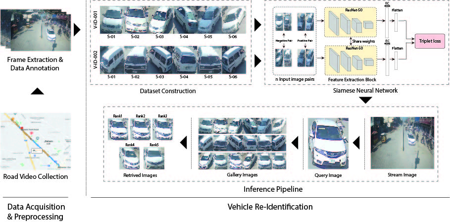
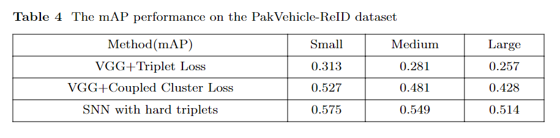
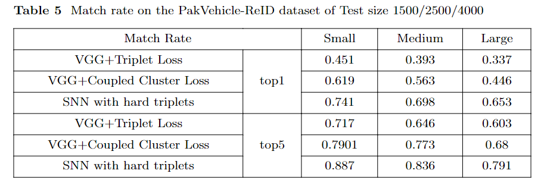
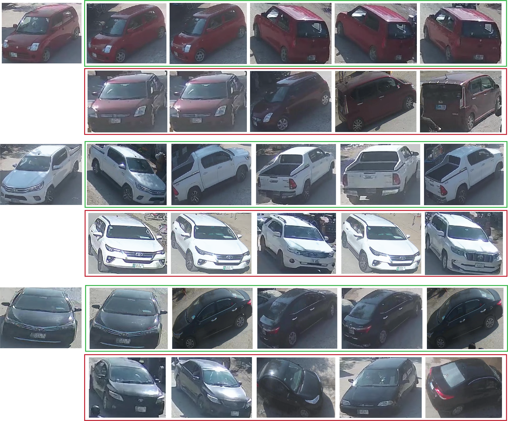

## Pak-Vehicle-ReID: A Multi-perspective Benchmark for Vehicle Re-Identification
This repo is an implementation of the paper "**PakVehicle-ReID: A Multi-perspective Benchmark for Vehicle Re-Identification in Unconstrained Urban Road Environment**". 

<!-- - which is under review in **Pattern Recognition Letters**. The complete implementation along with the dataset has been released for the community use. -->

## Contents
1. [Introduction](#introduction)
2. [Network](#network)
3. [Setup](#setup)
4. [Usage](#usage)
5. [Results](#results)
6. [Authors](#authors)
7. [Citation](#citation)

## Introduction
The challenge of re-identifying vehicles in urban city surveillance systems and major traffic arteries such as highways and roads is an important area of research. The advent of large-scale benchmarks such as VeRI-776 and Vehicle-ID has propelled efforts to enhance search operations from large databases for re-identification. However, several unresolved challenges associated with vehicle re-identification in unconstrained environments remain to be explored. In order to foster research in this field, we have compiled a new multi-perspective dataset, PAKVehicle-ReId, captured by real-world surveillance cameras in urban cities in Pakistan and India. To the best of our knowledge, this is the first such dataset collected under unconstrained conditions in the Asian region. The dataset comprises 80,000 images of 20,000 unique vehicles. Additionally, a deep learning-based technique for extracting multi-dimensional robust features for vehicle re-identification using convolutional neural networks has been proposed. The results show the effectiveness of the proposed method on the PAKVehicle-ReId dataset as well as on two other existing datasets, VeRi-776 and VehicleID. 

## Network 



## Setup
1. cd to your preferred directory and run ' https://github.com/HassanAliAsghar/PakvehicleReId '.
2. The following libraries/packages are required for successful execution of this project.

  - PyTorch
  - Shapely
  - Opencv
  - TensorboardX

3. For convience, please execute `requirements.txt` in cmd prompt.

### Downloads
The following files must be downloaded for successful setup.
1. **Dataset**
    Please download the PakVehicle-ReID dataset from our google drive [link]().
    After completion, put the training and test folders in `dataset` directory.
    ```
├── Vehiclereid/
│   ├── datasets/                  
│   ├── PakVehicleID/                   
│       ├── Images 
│       ├── image_query
        ├── Train_test_splits/
            ├── train_list 
            ├── test_list
```


## Usage
### train
Input arguments for the training scripts are unified in [args.py](./args.py).
To train an image-reid model, you can do
```
python train_xent_tri.py \
-s Pakvehiclereid \    #source dataset for training
-t Pakvehiclereid \    # target dataset for test
--height 128 \ # image height
--width 256 \ # image width
--optim amsgrad \ # optimizer
--lr 0.0003 \ # learning rate
--max-epoch 60 \ # maximum epoch to run
--stepsize 20 40 \ # stepsize for learning rate decay
--train-batch-size 64 \
--test-batch-size 100 \
-a resnet50 \ # network architecture
--save-dir log/resnet50-Pakvehiclereid \ # where to save the log and models
--gpu-devices 0 \ # gpu device index
```
### test
Use --evaluate to switch to the evaluation mode. In doing so, no model training is performed.

```
python test_imgreid.py \
-s Pakvehiclereid \ # this does not matter any more
-t Pakvehiclereid \ # you can add more datasets here for the test list
--height 128 \
--width 256 \
--test-size 800 \
--test-batch-size 100 \
--evaluate \
-a resnet50 \
--load-weights path_to_model.pth.tar \
--save-dir log/Pakvehiclereid \
--gpu-devices 0 \
```
## Results

### Quantative Results


### Visual Results of Query Matching againts Vehicles Gallery 


# Authors

Hasan Ali Asghar <hasghar.mscs19seecs@seecs.edu.pk>

Bostan Khan <bkhan.mscs19seecs@seecs.edu.pk>

Zuhair Zafar <zuhair.zafar@seecs.edu.pk>

Muhammad Moazam Fraz <mfraz@turing.ac.uk>

# Citation
- If you follow the code or ideas from our paper, please cite our paper:
```
```
